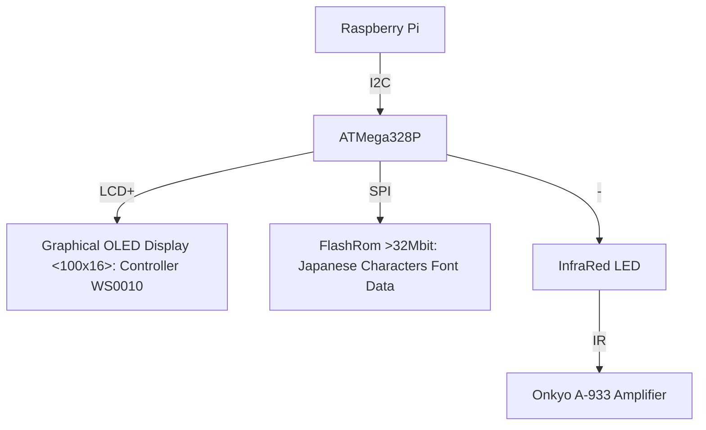

# Music player display for ATMege328P (Arduino Uno)
This is a I2C based Japanese character display with InfraRed output to control Onkyo A-933 amplifier.

## Chart

## Pin Assign　(ATMega328P PDIP28)

| pin # | name | function | 
| --- | --- | --- |
| 1 | nRESET  | Hardware reset |
| 2 | PD0 | OLED: Data 0 |
| 3 | PD1 | OLED: Data 1 |
| 4 | PD2 | OLED: Data 2 |
| 5 | PD3 | OLED: Data 3 |
| 7 | PD4 | OLED: Data 4 |
| 7 | VCC |  |
| 8 | GND |  |
| 9 | PB6 | N/C |
| 10 | PB7 | N/C |
| 11 | PD5 | OLED: Data 5 |
| 12 | PD6 | OLED: Data 6 |
| 13 | PD7 | OLED: Data 7 |
| 14 | PB0 | Debug: UART TX |
| 15 | PB1 | InfraRed output |
| 16 | PB2 | FlashRom: SPI/SS |
| 17 | PB3 | FlashRom: SPI/MOSI |
| 18 | PB4 | N/C |
| 19 | PB5 | FlashRom: SPI/SCK |
| 20 | AVCC |  |
| 21 | AREF |  |
| 22 | GND |  |
| 23 | PC0 | OLED: RS |
| 24 | PC1 | OLED: RW |
| 25 | PC2 | OLED: EN |
| 26 | PC3 | N/C |
| 27 | PC4 | Raspberry Pi: I2C/SDA |
| 28 | PC5 | Raspberry Pi: I2C/SCL |

## I2C Instructions (Write mode only)
| # | 1st Operand | 2nd Operand | function | 
| --- | --- | --- | --- |
| 1 | 0x00  | message data (encoding: Shift_JIS) | Print a message (Mincho 12X) |
| 2 | 0x01  | message data (encoding: Shift_JIS) | Print a message (Mincho 14X) |
| 3 | 0x02  | message data (encoding: Shift_JIS) | Print a message (Mincho 16X) |
| 4 | 0x03  | message data (encoding: Shift_JIS) | Print a message (Mincho 12) |
| 5 | 0x04  | message data (encoding: Shift_JIS) | Print a message (Mincho 14) |
| 6 | 0x05  | message data (encoding: Shift_JIS) | Print a message (Mincho 16) |
| 7 | 0x06  | message data (encoding: Shift_JIS) | Print a message (Gothic 12X) |
| 8 | 0x06  | message data (encoding: Shift_JIS) | Print a message (Gothic 14X) |
| 9 | 0x06  | message data (encoding: Shift_JIS) | Print a message (Gothic 16X) |
| 10 | 0x06  | message data (encoding: Shift_JIS) | Print a message (Gothic 12) |
| 11 | 0x06  | message data (encoding: Shift_JIS) | Print a message (Gothic 14) |
| 12 | 0x06  | message data (encoding: Shift_JIS) | Print a message (Gothic 16) |
| 13 | 0x10 | - | Scroll off |
| 14 | 0x11 | - | Scroll on |
| 15 | 0x12 | - | Display clear |
| 16 | 0x13 | - | Display on |
| 17 | 0x14 | - | Display off |
| 18 | 0x15 | - | Sleep |
| 19 | 0x16 | - | Wake up |
| 20 | 0x20 | - | Volume up (Onkyo A-933) |
| 21 | 0x21 | - | Volume down (Onkyo A-933) |
| 22 | 0x22 | - | Mute (Onkyo A-933) |
