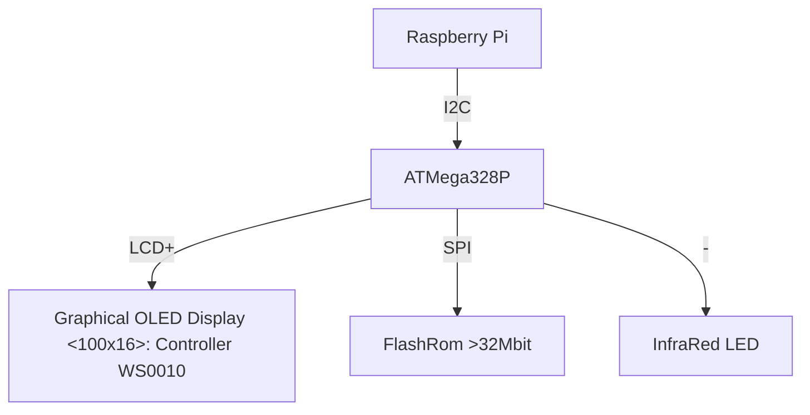

# Music player display for ATMege328P (Arduino Uno)

## Chart

# Pin Assign　(ATMega328P)

| pin # | name | function | 
| --- | --- | --- |
| 1 | nRESET  | Hardware reset |
| 2 | PD0 | OLED: Data 0 |
| 3 | PD1 | OLED: Data 1 |
| 4 | PD2 | OLED: Data 2 |
| 5 | PD3 | OLED: Data 3 |
| 7 | PD4 | OLED: Data 4 |
| 7 | VCC |  |
| 8 | GND |  |
| 9 | PB6 | N/C |
| 10 | PB7 | N/C |
| 11 | PD5 | OLED: Data 5 |
| 12 | PD6 | OLED: Data 6 |
| 13 | PD7 | OLED: Data 7 |
| 14 | PB0 | Debug: UART TX |
| 15 | PB1 | InfraRed output |
| 16 | PB2 | FlashRom: SPI/SS |
| 17 | PB3 | FlashRom: SPI/MOSI |
| 18 | PB4 | N/C |
| 19 | PB5 | FlashRom: SPI/SCK |
| 20 | AVCC |  |
| 21 | AREF |  |
| 22 | GND |  |
| 23 | PC0 | OLED: RS |
| 24 | PC1 | OLED: RW |
| 25 | PC2 | OLED: EN |
| 26 | PC3 | N/C |
| 27 | PC4 | Raspberry Pi: I2C/SDA |
| 28 | PC5 | Raspberry Pi: I2C/SCL |

